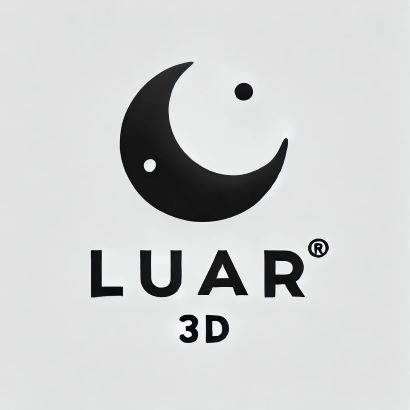

# Luar3D

3D Rendering framework that supports building for the web. Minimal code, intended for rapid prototyping and deployment. *Luar* is a galician word that means "light from the moon".

## Requirements

- Using **vs2022**
- For webasm, **emscripten should be installed and active** in the current user.

